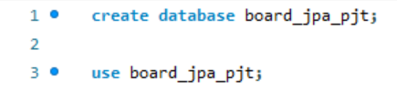

# 7/19

```properties
spring.application.name=board2024_boot_jpa

server.port=8083

spring.datasource.url=jdbc:mysql://localhost:3306/board_jpa_pjt?serverTimezone=Asia/Seoul&characterEncoding=UTF-8
// db 파일 경로 / ?부터는 한국시간, 한글 설정(사실 없어도 되는듯)
spring.datasource.username=root
spring.datasource.password=1157139
spring.datasource.driver-class-name=com.mysql.cj.jdbc.Driver


jpa.open-in-view=false
jpa.show-sql=true
spring.jpa.hibernate.ddl-auto=update
// 위 3줄 추가
```

```java
package com.codingrecipe.board2024_boot_jpa.entity;

import jakarta.persistence.*;

@Entity
@Table(name = "board_jpa_pjt")
// 테이블 이름 정하는 대로 테이블이 생성된다. 유의 할 것
public class BoardEntity {
    @Id
    @GeneratedValue(strategy = GenerationType.IDENTITY)
    private Long id;

    @Column(length = 30, nullable = false)
    private String boardWriter;

    @Column
    private String boardTitle;
}
```

